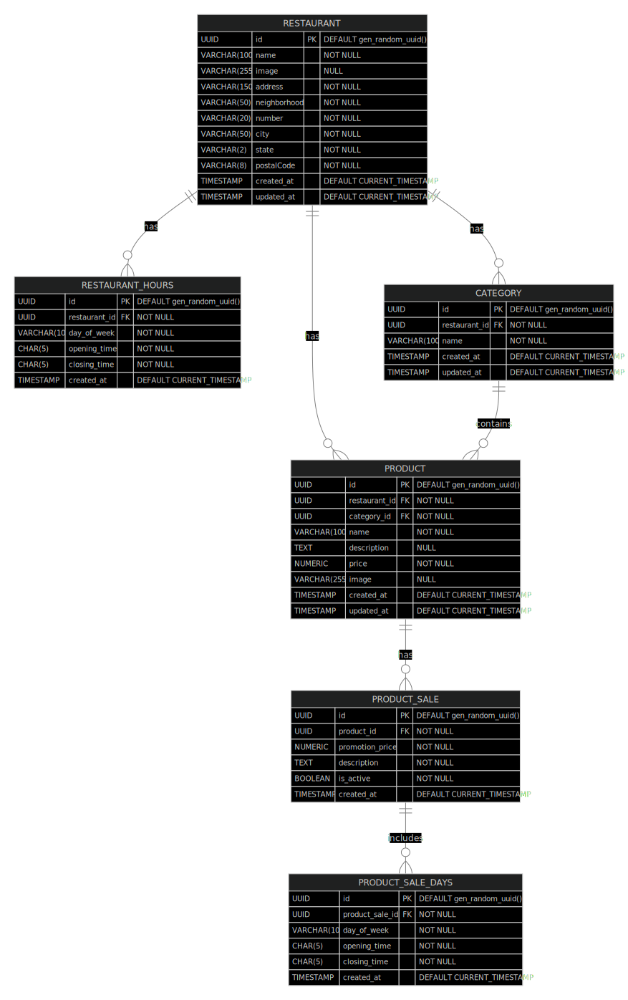

# Rango Food 

Rango Food é uma API RESTful para cadastro de restaurantes e produtos. O sistema foi desenvolvido em NodeJS e utiliza o banco de dados PostgreSQL. A API contempla cadastro de restaurantes, produtos, categorias de produtos, horário de funcionamento dos restaurantes e promoções.

### :memo: Funcionalidades
- [x] Restaurantes
    - [x] O sistema deve permitir o cadastro de restaurantes
    - [x] O sistema deve permitir o cadastro de imagem do restaurante
    - [x] O sistema deve permitir a alteração de restaurantes
    - [x] O sistema deve permitir a alteração da imagem do restaurante
    - [x] O sistema deve permitir a exclusão de restaurantes
    - [x] O sistema deve permitir a listagem de restaurantes
    - [x] O sistema deve permitir a busca de restaurante pelo Id
    - [x] O sistema deve permitir o cadastro de horário de funcionamento do restaurante
    - [x] O sistema deve permitir a alteração de horário de funcionamento do restaurante

- [x] Produtos
    - [x] O sistema deve permitir o cadastro de categorias de produtos
    - [x] O sistema deve permitir a alteração de categorias de produtos
    - [x] O sistema deve permitir a exclusão de categorias de produtos
    - [x] O sistema deve permitir a listagem de categorias de produtos
    - [x] O sistema deve permitir a listagem de categorias de produtos de um restaurante
    - [x] O sistema deve permitir o cadastro de produtos
    - [x] O sistema deve permitir o cadastro de imagem do produto
    - [x] O sistema deve permitir a alteração de produtos
    - [x] O sistema deve permitir a alteração da imagem do produto
    - [x] O sistema deve permitir a listagem de produtos
    - [x] O sistema deve permitir a exclusão de produtos
    - [x] O sistema deve permitir a listagem de produtos pelo restaurante
    - [x] O sistema deve permitir a busca de produto pelo Id
    - [x] O sistema deve permitir adicionar um produto em promoção
    - [x] O sistema deve permitir remover um produto da promoção
    - [x] O sistema deve permitir remover um produto da promoção

### RNF - Requisitos não Funcionais 
- O sistema deve ser desenvolvido em NodeJS
- O sistema deve ter testes unitários
- O sistema deve ter testes de integração
- O sistema deve ter uma estrutura escalável
- O código deve ser legível e organizado
- Não utilizar framework que estabeleça um padrão de arquitetura
- Não utilizar query builder 
- Utilizar raw query para as consultas no banco de dados

### Regras de Negócio
- O intervalo de horário de funcionamento do restaurante deve ter no mínimo 15 minutos;
- O intervalo de promoção do produto deve ter no mínimo 15 minutos;
- Não deve existir dois registros de horário de funcionamento do restaurante no mesmo intervalo de tempo no mesmo dia;
- Não deve existir dois registros de promoção do produto no mesmo intervalo de tempo no mesmo dia;

### Melhorias Futuras 
- Criar rotas de pesquisa (/search) para restaurantes e produtos com filtros e paginação
- Criar novo provider de Armazenamento de arquivos na nuvem (AWS S3)
- As validações simples de dados já estão traduzidas (Zod i18n), mas as validações de caso de uso estão em inglês. Criar resources para tradução das mensagens de erro.
- Criar um provider de cache para armazenar os dados de restaurantes e produtos

### Diagrama de Entidade e Relacionamento

### Configuração do ambiente
Para configurar o ambiente é necessário ter:
- NodeJS
- Docker
- Docker Compose

#### Variáveis de ambiente
Para configurar as variáveis de ambiente, crie um arquivo `.env` na raiz do projeto e adicione os valores desejados. Utilizar como referência o arquivo `.env.example`.

- :computer: Utilize `.env.dev` para ambiente de desenvolvimento;
- :test_tube: Utilize `.env.test` para ambiente de testes;
- :rocket: Utilize `.env` para ambiente de produção;

#### Scripts
- `npm run dev`: Inicia o servidor em modo de desenvolvimento
- `npm run test`: Executa os testes unitários
- `npm run test-integration`: Executa os testes de integração
- `npm run db-dev-up`: Inicia container com banco de dados PostgreSQL no ambiente de DEV com base no arquivo `.env.dev`
- `npm run db-dev-down`: Remove container com banco de dados PostgreSQL no ambiente de DEV
- `npm run db-test-up`: Inicia container com banco de dados PostgreSQL no ambiente de TEST com base no arquivo `.env.test`
- `npm run db-test-down`: Remove container com banco de dados PostgreSQL no ambiente de TEST

#### Instalação de dependências

Para instalar as dependências do projeto, execute o comando abaixo:
`npm install`

### Dependências
[NodeJS](https://nodejs.org/en/) - Ambiente de execução JavaScript
[Express](https://github.com/expressjs/express) - Framework para desenvolvimento de aplicações web
[Tsrynge](https://github.com/microsoft/tsyringe) - Injeção de dependência
[TypeORM](https://github.com/typeorm/typeorm) - Usado apenas para conexão com o banco de dados
[Vitest](https://github.com/vitest-dev/vitest) - Criação de testes automatizados
[Supertest](https://github.com/ladjs/supertest) - Para testes de rotas
[http-status-codes](https://github.com/prettymuchbryce/http-status-codes) - Para enums contendo os códigos de status HTTP
[dotenv](https://github.com/motdotla/dotenv) - Para carregar variáveis de ambiente
[Zod](https://github.com/colinhacks/zod) - Para validação de dados

